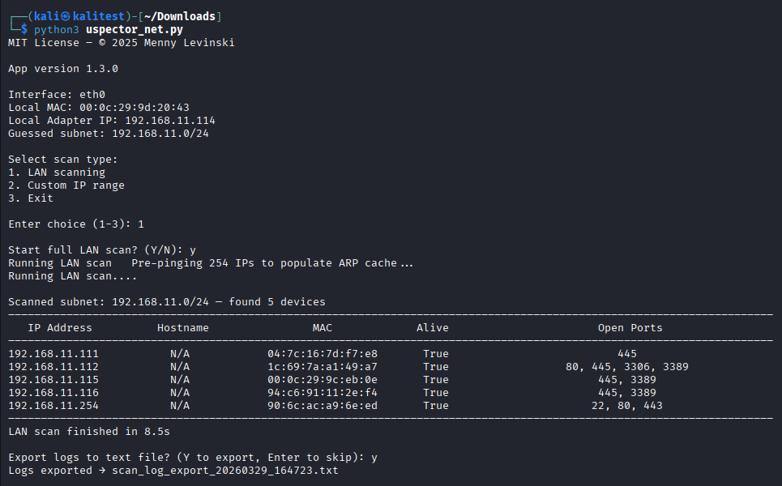

<div align="center" style="line-height: 0;">
    <a href="https://github.com/mennylevinski/uspector-net">
        
    </a>
</div>

# Uspector Network Scanner

**Uspector** is a lightweight, cross-platform Python network scanner that enables device discovery and open port detection across local IPv4 networks, including Wi-Fi and Ethernet.
Built for ethical diagnostics, security awareness, and administrative auditing, it is suitable for both personal and organizational use.

Licensed under the [MIT License](LICENSE).

---

## ✨ Features

- **LAN Detection Mode**, detects your IPv4 subnet and scans the local network
- **Custom Scan Mode**, user can select to target a spesific IP address or IP ranges
- **Fast & Accurate**, combines ICMP, ARP, and socket checks and auto discovery
- **Port Detection**, scans common service ports (FTP, SMB, SSH, RDP, and more)
- **Logging system**, exportable log file (TXT format) for more detailed output
- **Terminal / CLI**, clean “black console” output, stays open after completion
- **Native Traffic Inspection** module, real-time monitoring of active TCP connections (Beta)

For a detailed list of all common ports scanned by Uspector, see [PORTS.md](PORTS.md)

<br>



---

## ✔️ Lawful Use

This tool is intended solely for lawful and authorized use.
You must obtain explicit permission from the network owner before scanning, auditing, or testing any systems.
The author assumes no liability for misuse or for actions that violate applicable laws or organizational policies.
Use responsibly and in compliance with your local governance.

---

## 📌 Safety Notice

**Uspector Network Scanner** is safe to use when downloaded from the official source.
Because the application performs network discovery and scanning, some antivirus products may incorrectly flag or restrict its execution. This is a common false positive for legitimate network diagnostic tools.
If you trust this application, you may need to add it as an exception in your antivirus software.

---

## 💾 Installation

### 💻 Windows EXE

Download the latest **[release](https://github.com/mennylevinski/uspector-net/releases)**. Extract the archive, then double-click the executable to run.

> No Python installation required (portable executable)

If Microsoft Defender SmartScreen appears:
- Click More info
- Click Run anyway

---

### 🐍 Cross-platform

#### 1️ Requirements
- Python **3.0+**
- Works on **Windows**, **Linux**
- Requires: `pip install psutil`

#### 2️ Script
- Download the script [uspector_net.py](src/uspector_net.py)

#### 3️⃣ Run
- Windows: `python uspector_net.py`
- Linux:<br> 
      1. `chmod +x uspector_net.py` <br>
      2. `python3 uspector_net.py`

---

## 📁 Project Structure

```bash
uspector-net/             # Main project folder
│
├── build/                # PyInstaller configs / EXE build
│
├── media/                # Images, diagrams, UI assets
│
├── src/                  # Core application source code
│
├── CHANGELOG.md          # Version history
├── CONTRIBUTING.md       # Contribution guidelines
├── LICENSE               # Project license
├── PORTS.md              # List of all common ports scanned by Uspector
├── README.md             # Main documentation
├── SECURITY.md           # Security policy
└── .gitignore
```
